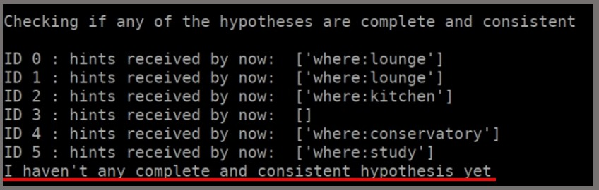

# Experimental Robotics Laboratory - Third assignment
Maria Luisa Aiachini - 4375373

### General introduction
This project simulates a simple version of cluedo. The robot is inside a labyrinth made of 6 rooms that have known positions:(-4,-3)(-4,2)(-4,7)(5,-7)(5,-3)(5,1). The robot needs to go inside each room and search for hints using two cameras. The hints are made by aruco markers: there are 5 markers in each room. The markers can have three different positions: placed at the top of the walls and on the floor vertically or horizontally. The robot will go in each room in random order, if it visites all of them without having a complete and consistent hypothesis (composed of three hints all with different keys: who, what, where) to check it will start again going in each room, again in random order. Whenever it finds a complete and consistent hypothesis it will go to home position (0,-1) to check if it is the winning one. If so the game ends; if not it will start again searching. 

### Expected behavior

The robot once the simulation has started execute the following steps:
- Randomly chooses which room to visit
- Moves towards that room
- Once the room is reached it starts to turn in on itself to look for markers
- Checks if it has any complete and consistent hypothesis
- If yes, goes to home position to check if it is the winning one
- If not, randomly chooses the next room to visit
- If winning hypothesis is found the game ends
- If not, the behavior starts from the beginning


### Software architecture

Inside the projext there are 4 main nodes:
- [controller.py](https://github.com/Marilwoo/exprob_3/blob/master/scripts/controller.py): this node contains the finite state machine that manages the robot's movements and actions. The state machine manages:
	- Deciding the next room to be visited in a random way
	Using `/move_base` action client:
	- Movement towards the rooms
	- Movement towards home position
	Using `/cmd_vel` publisher:
	- Turning on itself to look for hints around the room
	Using `/hint_list` client:
	- Retreives the complete list of hints and hypotheses obtained and analyses them to check for complete and consistent hypotheses
	Using `/oracle_solution` client:
	- Asks for the winning ID and compares it to the IDs corresponding to complete and consistent hypotheses to check if the winning one has been found
	
- [hint_manager.py](https://github.com/Marilwoo/exprob_3/blob/master/scripts/hint_manager.py): this node is the one that receives the IDs from the markers, it is used to check if the hints received are valid or not and to store the valid ones.
	Using `/IDs` publisher:
	- Receives the IDs the cameras retreive from the Aruco markers
	Using `/oracle_hint` client:
	- Asks for the hint by sending as a request the ID from the marker
	Using `/hint_list` server:
	- It sends the list of hypotheses retreived
	
- [simulation.cpp](https://github.com/Marilwoo/exprob_3/blob/master/src/simulation.cpp): this node was given. It is used to send the hints corresponding to the markers' IDs, also it has the ID of the winning hypothesis.
	Using `/oracle_hint` server:
	- Sends the hint corresponding to the markers' IDs
	Using `/oracle_solution` server:
	- Sends the winning ID as an int
	
- [marker_publish.cpp](https://github.com/Marilwoo/exprob_3/blob/master/src/marker_publish.cpp): The base node can be cloned from [here](https://github.com/CarmineD8/aruco_ros/blob/main/aruco_ros/src/marker_publish.cpp). It is the node that connects to the cameras and makes them able to recolgnise the Aruco markers and read their IDs. The base node has been modified for connecting it to two cameras and to send the IDs read from the markers.
	Using `/image` subscriber:
	- Reads the IDs from the first camera
	Using `/image2` subscriber
	- Reads the IDs from the second camera
	Using `/IDs` publisher:
	- Publishes the IDs read from both cameras.

#### ROS msgs
Ros messages in erl2 package
- [ErlOracle.msg](https://github.com/CarmineD8/erl2/blob/main/msg/ErlOracle.msg): used by Marker.srv, contains the three parameters that make up the hint.
```
int32 ID
string key
string value
```

#### ROS srv
- Ros services in exprob_3 package:
	- [Hints.srv](https://github.com/Marilwoo/exprob_3/blob/master/srv/Hints.srv): used by `/hint_list`. Used to send the hypotheses list.
	```
	---
	string[] hint_0
	string[] hint_1
	string[] hint_2
	string[] hint_3
	string[] hint_4
	string[] hint_5
	```
	
	- [Marker.srv](https://github.com/Marilwoo/exprob_3/blob/master/srv/Marker.srv): used by `/oracle_hint`. Used to send the hint corresponding to the marker id requested.
	```
	int32 markerId
	---
	erl2/ErlOracle oracle_hint
	```
	
- Ros services in erl2 package:
	- [Oracle.srv](https://github.com/CarmineD8/erl2/blob/main/srv/Oracle.srv): used by `/oracle_solution`. Used to send the winning ID when requested.
	```
	---
	int32 ID
	```
	
### Installation and how to run
For this project you need to clone in your ros_ws ROS workspace these packages:
- [Aruco_ros package](https://github.com/CarmineD8/aruco_ros)
- [slam_gmapping package](https://github.com/CarmineD8/SLAM_packages/tree/noetic)
- [erl2 package](https://github.com/CarmineD8/erl2/)
- [exprob_3 package](https://github.com/Marilwoo/exprob_3)

To build the code run:
```
catkin_make
```
Launch the simulation with:
```
roslaunch exprob_3 simulation.launch
```
**To get rid of unwanted warning messages launch the simulation with:**
```
roslaunch exprob_3 simulation.launch 2> >(grep -v TF_REPEATED_DATA buffer_core)

```

### Working description: screenshots of running program
Images of the working environment of the project. On the left seen on Gazebo: you can see the rooms and the markers in the three different positions. On the right the same ambient seen on Rviz, with, on the left, the two raw images of the two cameras.

Here the screenshots of the terminal on different topics:
- At the top the selection of the random room and the selected one to which the robot will head. At the bottom the end of the movement and the moment the robot wills art turning on itself to look for hints

- Here the messages printed when a hint is received. From left to right: valid hint, value error and key error

- Here the robot has not found any complete or consistent hypotheses during his search

- Here the robot has found a complete and consistent hypothesis : ID3, so it will go towards home to verify if it is the winning one. Once at home it will find oput that that is not the winning one and so the search will start again from the point it was intrrupted

- Here the robot has a complete and consistent hypothesis: ID0, it will start going home to check if it is the winning one. It finds oput that the hypothesis is the winning one, so the program ends.


### System features
The system uses move_base algorithm for managing the robot's movement. The path the robot does every time it needs to reach a room is made different by the choise of randomizing the rooms order. In this way it happens that when a room is reached for the second time, this is done with a different path with respect to the first one and this is chosen because, with different path the robot is able to touch different points and rise the possibility to reach new markers.
The search for the hints is made by the use of two cameras to improve the probability of seeing the markers, as one only camera was not enough to retreive a sufficient number of markers' IDs. 
Because the cameras are working at any time during the project they will also be able to get hints while the robot is moving between the rooms and not only when the room is reached. This is also to maximise the number of merkers read.

### System limitation
The main limitation of the project is the speed of the simulation. Probably because the high load of the simulation, it can take a lot of time to come to an end. The more time consuming moments are when the robot has reached the target, but move_base algorithm can take very long time to send the result, this results in the robot staying in the same position for quite a long time before changing the state and moving on.
Another limitation is the fact that not all the hints are taken at the first time the marker are in the cameras view. For taking them it is needed that the robot go back to each room a few times. This problem is partially overcame by the randomness of the order of the rooms.

### Possible improvements
The main improvement for this project is probably to make the robot move inside each room and find a way to make sure it has taken all the hints present in the room. This will guarantee that all the hints are found at the first time and make the completion faster.

### Contacts
Maria Luisa Aiachini - 4375373

4375373@studenti.unige.it
